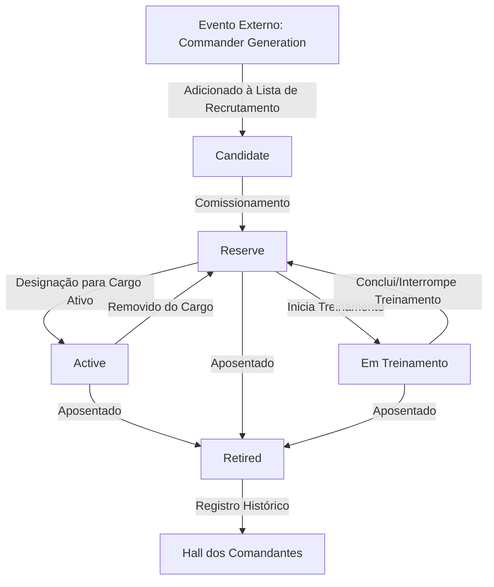

# COMMAND_CENTER.md

# Centro de Comando (CdC)

## Objetivo

O Centro de Comando (CdC) é o sistema responsável pela administração da carreira dos Comandantes do Reino.

Sua função é organizar toda a estrutura militar necessária para recrutar, desenvolver, administrar e preservar os comandantes ao longo da evolução do Reino.

O CdC não interfere diretamente nas batalhas.

Ele não controla PvP, PvE ou Minas.

Esses modos de jogo possuem regras próprias e independentes.

O CdC administra exclusivamente os recursos humanos militares do Reino.

---

# Filosofia e Single Source of Truth (SSoT)

O Centro de Comando foi concebido para representar a evolução administrativa do Reino.

Ele é o proprietário (Single Source of Truth) do ciclo de vida administrativo dos comandantes. Nenhum outro sistema altera diretamente esse ciclo de vida. PvP, PvE, Minas, Combate e demais sistemas apenas consultam ou utilizam o estado administrativo existente.

Seu crescimento não torna os comandantes mais fortes.

Seu crescimento aumenta a capacidade do Reino de administrar um número maior de comandantes e de oferecer melhores condições para seu desenvolvimento.

Essa separação garante que:

* Progressão administrativa;
* Progressão dos comandantes;
* Progressão das cartas;
* Progressão do Reino;

permaneçam independentes entre si.

---

# Missão

O CdC possui cinco responsabilidades principais.

1. Criar novos Cargos de Comando.
2. Administrar o recrutamento de comandantes.
3. Desenvolver comandantes através do treinamento.
4. Administrar o sistema de Legado.
5. Registrar permanentemente a história militar do Reino.

---

# O que o CdC NÃO faz

O Centro de Comando não:

* controla batalhas;
* limita quantos comandantes podem participar do PvP;
* limita quantos comandantes podem participar do PvE;
* limita quantos comandantes podem participar das Minas;
* concede atributos para cartas;
* concede atributos para comandantes.

Sua função é exclusivamente administrativa.

> **Nota de esclarecimento (`COMMAND_CENTER_UI.md`):** essa exclusividade administrativa se refere às *regras* de PvP, PvE e Minas — que continuam soberanas em seus respectivos documentos (`RANKING.md`, `PvE.md`, `MINES.md`). O CdC funciona como a **interface operacional** através da qual o jogador organiza e aciona a utilização de seus Comandantes e Exércitos nesses modos. Ele organiza o acesso; nunca decide a regra.

---

# Estrutura Geral

O sistema é dividido em cinco subsistemas independentes.

```text
Centro de Comando

│

├── Progressão

├── Recrutamento

├── Treinamento

├── Legado

└── Interface

```

Cada um desses sistemas possui documentação própria.

---

# Estrutura Administrativa

Dentro da narrativa do jogo, o Centro de Comando é composto pelos seguintes departamentos.

## Gabinete de Recrutamento

Responsável pela contratação de novos comandantes.

---

## Departamento de Campo

Responsável pela criação e administração dos Cargos de Comando Ativos.

---

## Arquivo Militar

Responsável pela administração da Reserva Militar.

---

## Centro de Treinamento

Responsável pelo desenvolvimento passivo dos comandantes.

---

## Conselho do Legado

Responsável pela aposentadoria dos comandantes e concessão dos bônus permanentes ao Reino.

---

## Hall dos Comandantes

Responsável pelo registro permanente da história militar do Reino.

---

# Ciclo de Vida do Comandante

Todo comandante obrigatoriamente percorre o fluxo de estados administrativos abaixo. A geração do comandante é um evento externo (ver `COMMANDER_GENERATION.md`). O Centro de Comando assume a responsabilidade administrativa apenas quando o comandante ingressa no estado `Candidate`.



Este fluxo representa toda a máquina de estados administrativos da carreira de um comandante dentro do Reino. O `Hall dos Comandantes` constitui o registro histórico permanente e não participa mais da máquina de estados administrativa após a aposentadoria (`Retired`).

---

# Estados Administrativos do Comandante

Abaixo estão definidos os estados administrativos oficiais e exclusivos que um comandante pode ocupar sob a jurisdição do Centro de Comando.

* **Candidate (Candidato):** O comandante está listado no Gabinete de Recrutamento, aguardando contratação (Comissionamento).
* **Reserve (Reserva):** O comandante pertence ao Reino e foi Comissionado, mas não ocupa um Cargo de Comando Ativo, nem está em treinamento.
* **Training (Em Treinamento):** O comandante está alocado no Centro de Treinamento para desenvolvimento passivo.
* **Active (Ativo):** O comandante ocupa um Cargo de Comando Ativo no Departamento de Campo.
* **Retired (Aposentado):** O comandante encerrou sua carreira militar através do Conselho do Legado. Este é o estado administrativo final.

### Regra Geral de Exclusividade

Um comandante pode ocupar apenas um Estado Administrativo por vez. Os estados são mutuamente exclusivos. Combinações como `Active + Training`, `Retired + Active` ou `Candidate + Reserve` são impossíveis.

---

# Relação entre os Sistemas

O Centro de Comando cria capacidade administrativa.

O sistema de Recrutamento utiliza essa capacidade para contratar novos comandantes.

O sistema de Treinamento desenvolve esses comandantes.

O sistema de Legado transforma comandantes aposentados em benefícios permanentes para o Reino.

O Hall dos Comandantes preserva permanentemente sua história.

Cada sistema é independente, mas todos compartilham o mesmo ciclo de vida e máquina de estados.

---

# Plano de Campanha — Mapeamento de Campos de Batalha, Ordem de Ataque e Defesa

O Plano de Campanha (Ligas Prata, Ouro e Diamante — inscrição e regras de bloqueio definidas em `RANKING.md`) possui as seguintes configurações operacionais, geridas através do CdC.

## Mapeamento de Campos de Batalha

Existem 10 Campos de Batalha no total (`BATTLEFIELDS.md`): o Campo Aberto (Padrão) e 9 Campos Especiais (3 Climáticos, 3 Geográficos, 3 Místicos).

* O **Campo Aberto** pode ser associado a mais de um dos 3 Exércitos simultaneamente — é o único Campo compartilhável.
* Os **9 Campos Especiais** são distribuídos exclusivamente entre os 3 Exércitos, de 0 a 9 Campos por Exército, sem repetição entre eles (um Campo Especial nunca pertence a mais de um Exército ao mesmo tempo).

## Defesa: Sempre Automática, Nunca Escolhida Manualmente

Não existe a designação de um "Exército de Defesa" fixo. Quando o jogador é alvo de um ataque, o Campo de Batalha é sorteado (`BATTLEFIELDS.md`) e o sistema identifica automaticamente qual dos 3 Exércitos está mapeado àquele Campo — é esse Exército que defende, sempre, sem exceção.

* Para os 9 Campos Especiais, o mapeamento já resolve isso sozinho (dono único por Campo).
* Para o Campo Aberto (compartilhável), o jogador pré-designa um **Exército de Defesa Preferencial** entre os Exércitos mapeados a ele — é esse quem defende sempre que o Campo Aberto for sorteado contra o jogador.
* **A energia do Exército defensor nunca é verificada.** A defesa ocorre de forma passiva e está sempre disponível, independentemente do estado de energia.

## Ataque: Restrito pela Energia Disponível

Quando o jogador inicia um Ataque, o Campo de Batalha é sorteado **apenas entre os Campos cujo Exército mapeado ainda possui energia suficiente** (`ENERGY.md`: 10 pontos por Ataque). Um Campo cujo Exército está sem energia suficiente não participa do sorteio naquele momento.

* Se, no momento do sorteio, mais de um dos 3 Exércitos estiver elegível para o Campo Aberto (por terem energia e estarem mapeados a ele), a **Ordem de Ataque** — definida livremente pelo jogador — desempata qual deles é usado primeiro. Quando o Exército da vez fica sem energia, a vez passa para o próximo da Ordem.
* Para os 9 Campos Especiais não há o que desempatar: cada um já tem um único Exército mapeado.
* Se nenhum dos 3 Exércitos tiver energia suficiente para nenhum Campo, Atacar fica indisponível até a energia de algum deles recuperar (`ENERGY.md`, "Recuperação de Energia") — consequência natural da regra acima, não uma regra à parte.

## Configurações Livres

O jogador pode alterar livremente, a qualquer momento do ciclo, o mapeamento dos Campos Especiais, a Ordem de Ataque, e o Exército de Defesa Preferencial do Campo Aberto — junto das demais trocas livres já previstas em `RANKING.md` ("Ajuste de Exércitos").

---

# Organização da Documentação

A documentação do Centro de Comando está dividida nos seguintes arquivos.

```text
command_center/

│

├── COMMAND_CENTER.md

├── COMMAND_CENTER_PROGRESS.md

├── COMMAND_CENTER_RECRUITMENT.md

├── COMMAND_CENTER_TRAINING.md

├── COMMAND_CENTER_LEGACY.md

└── COMMAND_CENTER_UI.md

```

---

# Responsabilidade de cada Documento

## COMMAND_CENTER.md

Visão geral do sistema.

Define a missão do Centro de Comando, sua arquitetura, os estados administrativos e a relação entre seus subsistemas.

---

## COMMAND_CENTER_PROGRESS.md

Define toda a Progressão Vertical e a Expansão Administrativa do Centro de Comando.

Inclui:

* evolução;
* PG;
* capacidade;
* fórmulas;
* desbloqueios.

---

## COMMAND_CENTER_RECRUITMENT.md

Define todo o ciclo de recrutamento e comissionamento dos comandantes.

Inclui:

* recrutamento;
* lista de candidatos;
* contratação/comissionamento;
* reserva;
* cargos vagos.

---

## COMMAND_CENTER_TRAINING.md

Define o funcionamento completo do sistema de treinamento.

---

## COMMAND_CENTER_LEGACY.md

Define:

* aposentadoria;
* Legado;
* Hall dos Comandantes;
* bônus permanentes.

---

## COMMAND_CENTER_UI.md

Documenta todas as telas, menus, indicadores e fluxos de interface relacionados ao Centro de Comando.

---

# Relação com Outros Sistemas

O Centro de Comando interage diretamente com:

* Capital;
* Sistema de Comandantes;
* PvP;
* PvE;
* Minas;
* Sistema de Progressão;
* Economia;
* Legado.

Entretanto, nenhuma regra desses sistemas é definida neste documento.

Este arquivo descreve apenas a arquitetura do Centro de Comando.

---

# Princípios Fundamentais

Todo novo recurso relacionado aos comandantes deverá obedecer aos seguintes princípios.

* O CdC administra comandantes.
* O CdC é o proprietário (SSoT) do ciclo de vida administrativo dos comandantes.
* O CdC não interfere diretamente nas batalhas.
* Todo comandante inicia sua carreira no estado `Candidate`.
* Nenhum comandante ocupa um Cargo de Comando inexistente.
* Todo comandante aposentado permanece registrado permanentemente no Hall dos Comandantes, finalizado seu ciclo administrativo.
* Todo novo sistema relacionado aos comandantes deverá ser implementado em um dos módulos desta documentação, evitando concentrar responsabilidades em um único arquivo.

---

# Escopo do Documento

Este documento define:

* arquitetura do Centro de Comando;
* responsabilidades dos subsistemas;
* filosofia e SSoT administrativo;
* ciclo de vida e máquina de estados administrativos dos comandantes;
* ordem de ataque, Exército de Defesa e mapeamento de Campos de Batalha do Plano de Campanha;
* relação entre os módulos.

Este documento não define:

* regras de recrutamento (ver `COMMAND_CENTER_RECRUITMENT.md`);
* regras de treinamento (ver `COMMAND_CENTER_TRAINING.md`);
* regras de legado e Hall (ver `COMMAND_CENTER_LEGACY.md`);
* fórmulas detalhadas (ver `FORMULAS.md` e documentos específicos);
* progressão detalhada (ver `COMMAND_CENTER_PROGRESS.md`);
* ações de promoção (ver `COMMANDERS.md`);
* regras de combate e bônus em batalha (ver `COMBAT_CORE.md`, `COMBAT_RULES.md` e `COMMANDER_EFFECTS.md`);
* inscrição, papéis, Pontos de Liga e demais regras competitivas do Plano de Campanha (ver `RANKING.md`);
* telas, janelas e fluxos de interface (ver `COMMAND_CENTER_UI.md`).

---

# Referências

Este documento depende diretamente dos seguintes arquivos.

* PROJECT_STRUCTURE.md
* GLOSSARY.md
* FORMULAS.md
* COMMANDERS.md
* COMMANDER_GENERATION.md
* COMMANDER_RESTRICTIONS.md
* COMMANDER_REQUIREMENTS.md
* COMMANDER_TARGETS.md
* COMMANDER_EFFECTS.md
* COMMANDER_VALUES.md
* RANKING.md (inscrição, papéis e regras de bloqueio do Plano de Campanha)
* BATTLEFIELDS.md (consome o mapeamento Exército↔Campo de Batalha definido aqui)
* COMMAND_CENTER_UI.md (telas, janelas e fluxos de interface)

Os detalhes operacionais são definidos nos demais documentos do módulo `command_center`.